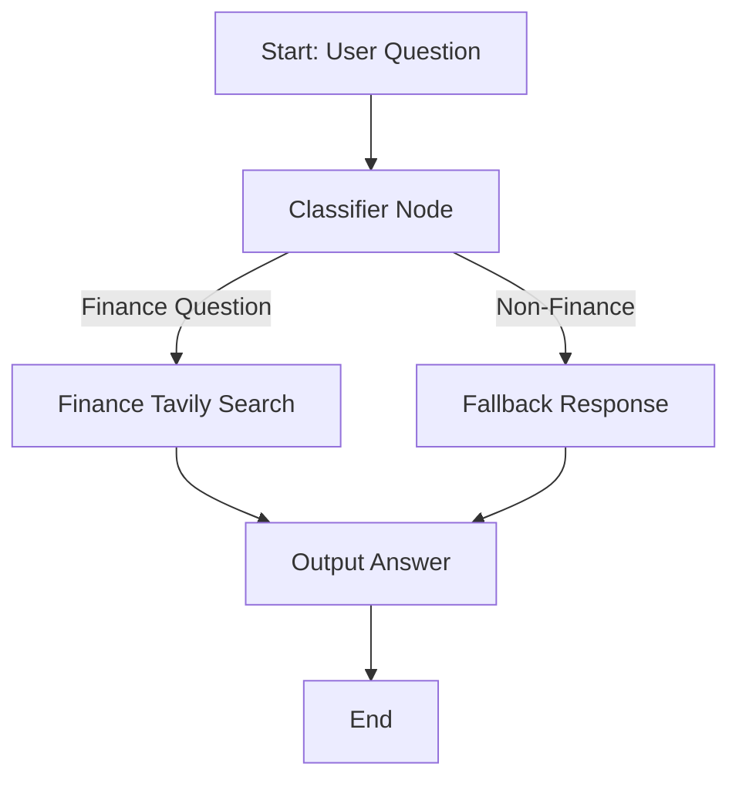

# Finance Question Answering System with LangGraph

## Overview

This project implements a finance-focused question answering system using LangGraph, which intelligently routes questions to either a finance-specific search or a fallback response based on the question content.

## Key Components

### LangChain Ecosystem
- **LangChain**: Provides the foundational framework for building language model applications
- **LangGraph**: Enables creating stateful, multi-actor applications with cyclic workflows
- **LangChain Community**: Offers integrations with third-party tools and services

These tools work together to create a flexible pipeline that can:
1. Classify incoming questions
2. Route them to appropriate handlers
3. Process finance questions with external search
4. Provide graceful fallbacks for non-finance questions

### Tavily Integration
Tavily is used as the search API because it:
- Provides high-quality, curated search results
- Offers specialized knowledge in finance/technical domains
- Has clean API responses that are easy to parse
- Includes features like search depth control and result filtering

## Installation

```bash
pip install langchain langgraph langchain-community tavily-python
```
  
## System Flow



## Usage
 - Set your Tavily API key in the script

 - Run the application: python llm.py
 
 - Enter finance-related questions when prompted

